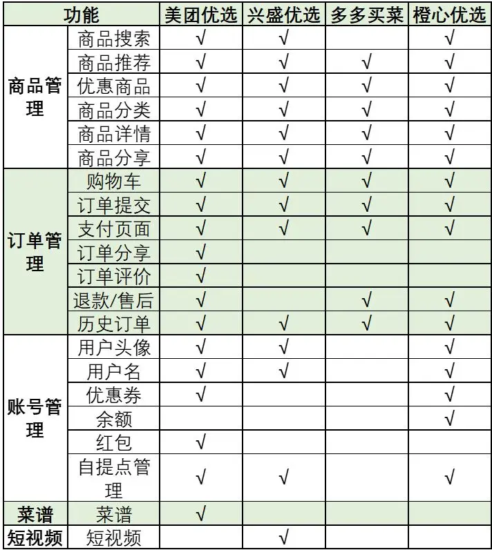

# 需求分析与设计

## 参考文档

主要参考以下两篇文章

1. [《社区团购产品竞品分析》](https://www.woshipm.com/evaluating/4265367.html)，主要分析了美团优选、橙心优选、多多买菜、兴盛优选四家产品，详细从基本信息与目标客户、核心功能结构、用户购物流程、核心功能体验等几个角度对四家产品进行了对比。

2. [《一篇关于社区团购的竞品分析》](https://www.niaogebiji.com/article-32843-1.html)，与上一篇类似，前半部分的行业分析写得更容易理解一些，但是后面详细对比的排版不容易读进去。

## 需求对比分析

与参考文档中的几家对比，瑶总鲜选一个最大的不同是没有平台与团长之分，或者说平台、团长、老板都是瑶总；此外，平台支撑人数较少，仅覆盖几个小区，短时间内也无需考虑过多的流量和推广。

参考文档1中，各平台（客户端）功能对比如下图：

上述四家产品中选择共有部分，可以理解为团购平台的基本功能，列举如下：

- 商品管理，包括商品推荐、优惠商品、商品分类、商品详情、商品分享

- 订单管理，包括购物车、订单提交、支付、历史订单

- 账号管理，无

考虑实际情况，参考竞品，可加入以下功能：

- 商品管理中的商品搜索功能，可以方便老客户或本次购物意向明确的客户快速查找定位商品

## 客户端概要设计

参考竞品，客户端设计为以下四个菜单（底部导航）：

1. 首页，展示推荐商品、优惠商品、商品分类

2. 分类，根据类别展示商品列表，并可点击进入商品详情页

3. 购物车，展示本次购物车内商品，可进行编辑或进入支付

4. 我的，展示历史订单，以及后续客服、反馈、发票等功能

具体功能及交互需参考详细设计。

## 管理后台概要设计

根据客户端功能，可分析得出管理后台需具备以下功能：

1. 统计概览，便于老板查看营收详情、订单总量等

2. 系统设置，包括对商品分类、优惠活动，以及配套的图片、文案等的设置

3. 商品管理，对商品进行上下架、定价、库存等的管理，以及配套的介绍文字和图片管理

4. 订单管理，查看当前和历史所有订单，包括订单状态、详情等，并需要汇总生成一天的订货单

其他如发票管理、售后管理、物流管理等，在开发前期暂不考虑，后续运行中视情况添加。具体功能及交互需参考详细设计。